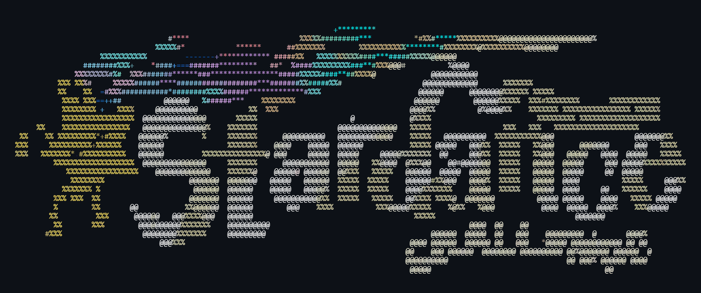
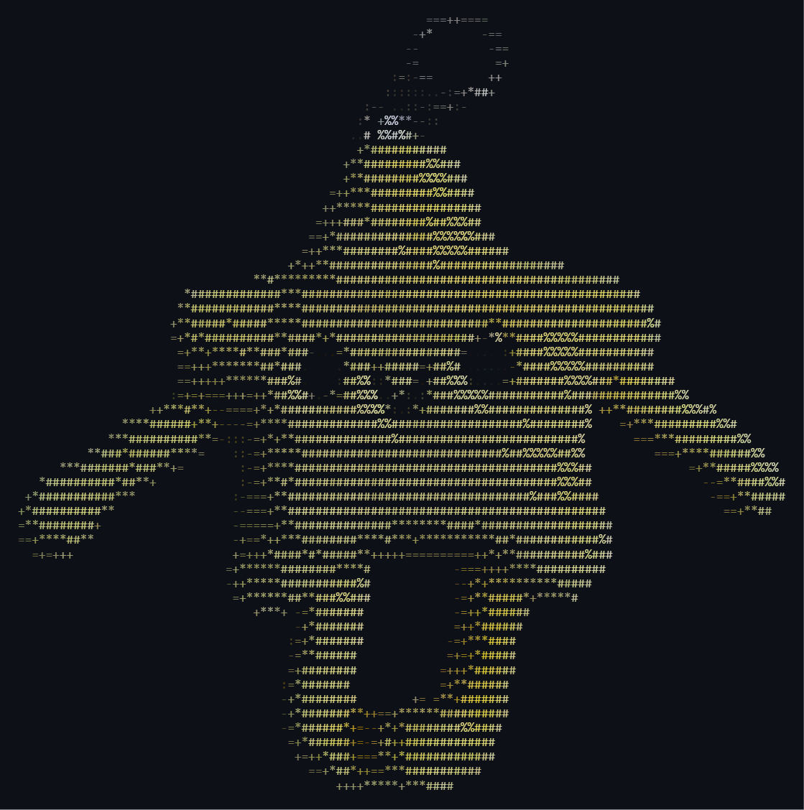

<p align="center">
  
</p>

<br>

<pre>
<span style="color: #888;">$ npx portfolio --welcome</span>

<span style="color: #2ea44f;">>></span> <b>HIツ</b>
<span style="color: #2ea44f;">>></span> WELCOME TO MY PORTFOLIO.
</pre>

<pre>
<span style="color: #888;">$ npx portfolio --initialize</span>

<span style="color: #2ea44f;">✔</span> <b>Loading Sudip Das...</b>
<span style="color: #2ea44f;">✔</span> Creative interface ............... READY
<span style="color: #2ea44f;">✔</span> Motion system ..................... READY
<span style="color: #2ea44f;">✔</span> Interactive 3D ................... READY
<span style="color: #2ea44f;">✔</span> Experimental systems ............. READY

<span style="color: #888;">[ React · Three.js · R3F · Framer Motion · Vite ]</span>
</pre>

   

<pre>
<span style="color: #888;">$ cat ./WhatIsThis.md</span>

This is my personal creative portfolio.

Not just a place to display my work,
but an experiment where the interface
becomes part of the work itself.

<span style="color: #888;">→</span> typography
<span style="color: #888;">→</span> motion
<span style="color: #888;">→</span> interaction
<span style="color: #888;">→</span> 3D
<span style="color: #888;">→</span> creative coding

<span style="color: #2ea44f;">✔</span> Built for Hack Club's Stardance Challenge.
</pre>

   

<pre>
<span style="color: #888;">$ npx explore-my-links --interactive</span>

<span style="color: #2ea44f;">✔</span> <b>Select a destination:</b>

 ❯ <a href="https://sudipdas2011.github.io/portfolio/">● Main Portfolio Website  [Production]</a>
   <a href="https://github.com/sudipdas2011/portfolio">○ Open Source Codebase    [GitHub]</a>

<span style="color: #888;">[Use arrow keys to navigate · click a destination to open]</span>
</pre>

   

<pre>
<span style="color: #888;">$ portfolio --experience</span>

  [01] HERO
       typography + orbiting cards + custom cursor

  [02] WHO AM I?
       interactive 3D head + custom shader

  [03] WHAT I DO
       interactive discipline navigation

  [04] WORK
       full-screen visual carousel

  [05] CONTACT
       interactive particle simulation

  [06] FOOTER
       socials + SDツ

<span style="color: #2ea44f;">✔</span> 6 sections detected
</pre>

   

<pre>
<span style="color: #888;">$ npx inspect headModel.glb</span>

  renderer ............. React Three Fiber
  engine ............... Three.js
  material ............. custom ShaderMaterial
  interaction .......... mouse velocity
  displacement ........ pointer reactive
  shading .............. procedural
  post-processing ...... bloom

<span style="color: #2ea44f;">✔</span> object successfully rendered
</pre>


   

<pre>
<span style="color: #888;">$ npm run interaction-test</span>

  custom cursor ................. ✓
  magnetic movement .............. ✓
  orbital cards .................. ✓
  smooth navigation .............. ✓
  keyboard controls .............. ✓
  pointer velocity ............... ✓
  particle response .............. ✓
  3D displacement ............... ✓

<span style="color: #2ea44f;">✔</span> 8 interaction systems online
</pre>

   

<pre>
<span style="color: #888;">$ npm list --tech-stack</span>

  React 19
  JavaScript
  Vite
  Three.js
  React Three Fiber
  Drei
  React Three Postprocessing
  Framer Motion
  React Router
  HTML Canvas
  CSS

<span style="color: #2ea44f;">✔</span> dependency tree looks creative
</pre>

   

<pre>
<span style="color: #888;">$ portfolio --build-log</span>

  → designed
  → animated
  → broke
  → debugged
  → rebuilt
  → optimized
  → experimented
  → repeated

<span style="color: #2ea44f;">✔</span> experience refined through iteration
</pre>

   

<pre>
<span style="color: #888;">$ portfolio --design-language</span>

  BRUTALISM
      +
  EDITORIAL TYPOGRAPHY
      +
  MOTION
      +
  INTERACTION
      +
  3D
      +
  CREATIVE CODING

<span style="color: #2ea44f;">✔</span> one interface, many experiments
</pre>

   

<pre>
<span style="color: #888;">$ portfolio --philosophy</span>

The goal wasn't to add as many effects as possible.

It was to make the interface feel responsive,
intentional and alive.

Every interaction exists for a reason:

<span style="color: #888;">→</span> movement should feel natural
<span style="color: #888;">→</span> typography should have motion
<span style="color: #888;">→</span> 3D should belong to the composition
<span style="color: #888;">→</span> interaction should reward curiosity

<span style="color: #2ea44f;">✔</span> design the interaction, not just the interface
</pre>


```bash
>> echo INSTALLATION

git clone https://github.com/sudipdas2011/portfolio.git
cd portfolio
npm install
npm run dev
```


```bash
>> echo PRODUCTION BUILD

npm run build
```

<pre>
<span style="color: #888;">$ exit</span>

  made with curiosity.
  BYEツ
</pre>


