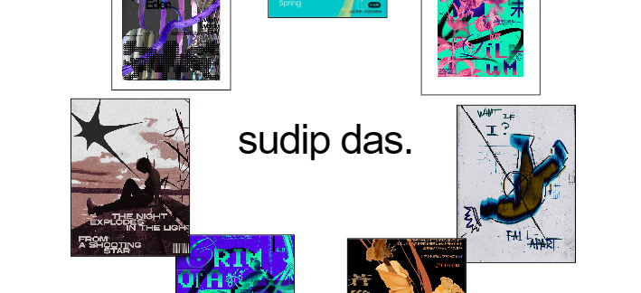

# HI ツ
### This is my creative artist portfolio built for the Stardance Challenge by HackClub.

  

  

### I took inspiration for the website's design from modern brutalism and made it simple.
### I wanted to make it different from other websites and portfolios.
### So, I added many micro interactive elements in this project.

---
# Key Features
- ### A custom cursor : a tiny square that follows your mouse movements and change it's shape based on interactive objects.
- ### The orbiting cards : some cards containing images orbiting the text in the Hero section.
- ### A magnetic pull effect : it uses mouse movements to move or jitter hovered objects to make it feels interactive and feel alive.
- ### An arrow guide ; it's a custom SVG arrow atthed to the custom cursor which actiavtes when in specified range(bottom 30% of the Hero section) to guide users to next section.

---
# Tech Stack
- ### React + Javascript (Vite)
- ### Framer Motion for smooth rotations of cards
- ### CSS (for layouts, blending and transitions)
---

# Challenges
### At first, till the first devlog evrything was going fine, like layout, positioning, evrything was just fine. 
### As I started to add more components like the Orbiting Cards, The rising effect Text component, the layout and positioning was the headache for me.
### Also optimized the cursor to act smooth by making it not just stick to pointer position but to follow it with a delay so that it feels smooth.
### Also add a detection system to detect moving objects under the cursor. Bcuz the main reason to do this was that when the cursor hoverd over any of the rotating cards , it would jus detect the single cards and if i stop moving the cursor, the enlarged cursor would stick there.
### At first, I was building the whole page in just `App.jsx` but later i seperated it into `Hero.jsx` and `WhoAmI.jsx`.

## you must try it out [here!](https://sudipdas2011.github.io/portfolio/)

## BYE ツ
